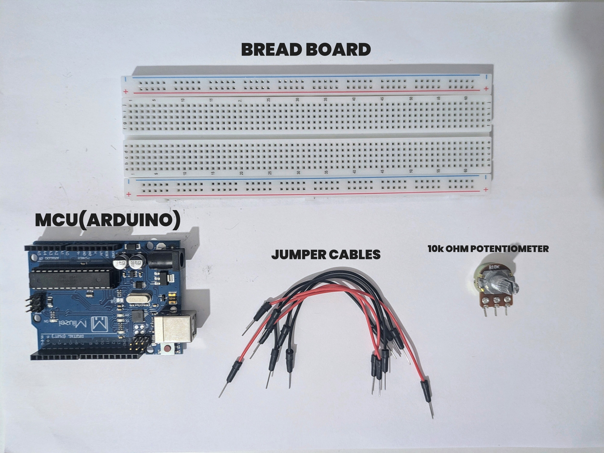
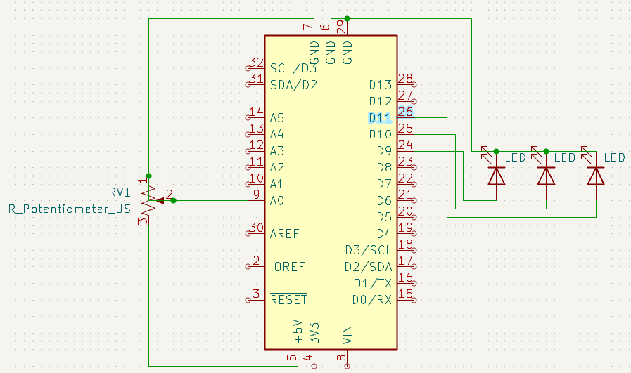

# Triple-LED-Dimmer  1
## Analog Input. PWM Output. Full Control.

**Fourth step** in the embedded grind. This isn’t just about lighting up LEDs—it’s about using analog input to shape digital output. **3 LEDs. 1 potentiometer. Real-time brightness control.** Precision through code.

---

## 🧭 Why This Matters 

Control is the name of the game. You’re not guessing—you’re sensing. Potentiometers simulate real-world input devices like volume knobs, dimmers, and control dials. This is the gateway to full analog/digital interfacing.

### ⚙️ What I Learned

- `analogRead()` grabs real-world values  
- `analogWrite()` translates that into PWM output  
- Analog control = more than ON/OFF logic  
- Real-time feedback makes systems feel alive  

---

## 🔩 Parts I Used


---

## 📈 Schematic



---

## 🛠️ Wiring


---

## 👨‍💻 The Code

```cpp
int sensorPin = A0;
int ledPins[] = {9, 10, 11};
int sensorValue = 0;
int brightness = 0;

void setup() {
  for (int i = 0; i < 3; i++) {
  pinMode(ledPins[i], OUTPUT);
}
  Serial.begin(9600);

}

void loop() {
  sensorValue = analogRead(sensorPin);
  brightness = map(sensorValue, 0, 1023, 0, 255);

  analogWrite(ledPins[0], brightness);  // First LED
  analogWrite(ledPins[1], brightness);
  analogWrite(ledPins[2], brightness);

  Serial.print("Sensor: ");
  Serial.print(sensorValue);
  Serial.print(" Brightness: ");
  Serial.println(brightness);

  delay(100);

}
```

## 🧠 The Concept
You turn the knob, and the LEDs respond. Smooth. Controlled. This isn’t guesswork—it’s analog input driving precise PWM signals. The logic is simple. The effect is powerful.

## 🎬 Final Result
One dial. Three LEDs. Infinite brightness levels.


# Check full video here: https://youtube.com/shorts/WQlMOFSCG8Q
